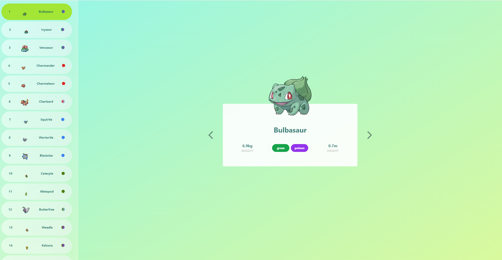

# Pokedex

**Official Link:**
[https://pokedex-weissleon.vercel.app](https://pokedex-weissleon.vercel.app)

🐷🐗🐭 여러분이 좋아하는 포케몬의 정보를 간단하게 확인해보세요!

어느 기기에서도 부드럽게 알려줄 거에요 🎉

## Lessons

- js는 모든 걸 throw할 수 있다. (충격)
  - 이 특성을 이용해서 Suspense가 동작한다 ㅎㄷㄷ
- framer-motion의 AnimatePresence는 Suspense에 안 먹힌다.
  - 이미 Issue에 올라온 문제이고 해결책은 제시되지 않았다.
  - 우회적으로 구현 가능하니 일단 문제는 없다.
- react-query의 infiniteQuery가 어떻게 캐싱을 갱신하는지 보니, page 단위로 refetching하는 거였다. (똑똑하군)
  - 물론 포켓몬 정보는 실시간 업데이트될 이유가 없어 `staleTime`을 `Infinity`로 놓았다.
- Promise.all을 통해 Sprite를 동시에 fetch 한다

## Library Used

### React

- React 18 RC
  - Suspense
  - useTransition
- React Error Boundary

### Routing

- React Router 6

### Networking

- Axios

### State Management

- React Query
- Zustand
- Immer

### UI

- SimpleBar
- Framer Motion
- gsap

## Remaining Task

- Clean up JSX structure.
- Clean up tailwind classes.
